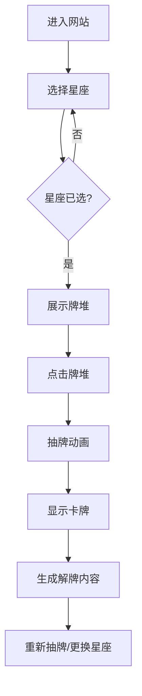

## 1. Product Overview
一款结合塔罗牌与十二星座的每日运势网站，为用户提供个性化的运势解读体验。用户通过选择星座并抽取塔罗牌，获得简短精准的每日运势指引。

## 2. Core Features

### 2.1 User Roles
| Role | Registration Method | Core Permissions |
|------|---------------------|------------------|
| Visitor | None | Select zodiac, draw tarot card, view interpretation |

### 2.2 Feature Module
1. **星座选择模块**: 展示12星座卡片，支持选择和切换
2. **塔罗抽牌模块**: 展示78张韦特塔罗牌堆，点击抽牌动画
3. **解牌结果模块**: 结合星座与卡牌生成运势解读

### 2.3 Page Details
| Page Name | Module Name | Feature description |
|-----------|-------------|---------------------|
| Home page | 星座选择区 | 12个星座卡片，镂空烫金花纹设计，悬浮/选中带紫色光晕 |
| Home page | 牌桌区域 | 圆形牌桌带3圈同心环和8个金色星点，牌堆展示 |
| Home page | 抽牌交互 | 点击牌堆触发抽牌动画，随机抽取一张牌 |
| Home page | 解牌结果 | 显示卡牌信息和结合星座的运势解读，≤200字 |

## 3. Core Process
用户进入网站 → 选择星座 → 点击牌堆 → 抽牌动画 → 显示卡牌 → 生成解牌内容

## 4. User Interface Design

### 4.1 Design Style
- **主色调**: 梦幻薰衣草紫色渐变背景
- **辅助色**: 金色（星座符号、牌桌装饰）、各元素色系（红/蓝/紫/绿）
- **动效**: 星星粒子、浮动光晕、抽牌动画、悬浮光效
- **字体**: 优雅衬线字体搭配现代无衬线字体
- **布局**: 卡片式布局，居中对称设计

### 4.2 Page Design Overview
| Page Name | Module Name | UI Elements |
|-----------|-------------|-------------|
| Home page | 背景 | 深黑紫→薰衣草紫渐变，淡紫色星星粒子，4个浮动光晕 |
| Home page | 星座卡片 | 镂空烫金花纹，四角小星座符号，超大星座水印，悬浮紫色光晕 |
| Home page | 牌桌 | 圆形设计，3圈同心环（最外圈虚线），8个金色星点，低透明度 |
| Home page | 卡牌 | 正面显示花色标签+对应颜色，78张全韦特牌 |

### 4.3 Responsiveness
- Desktop-first设计
- 移动端自适应：星座卡片改为垂直滚动，牌桌居中缩放

### 4.4 3D Scene Guidance
- 无3D场景需求，纯2D页面

## 5. 塔罗牌数据
- 大阿卡纳：22张（特殊解读）
- 权杖：14张（火元素，红色系）
- 圣杯：14张（水元素，蓝色系）
- 宝剑：14张（风元素，紫色系）
- 星币：14张（土元素，绿色系）
