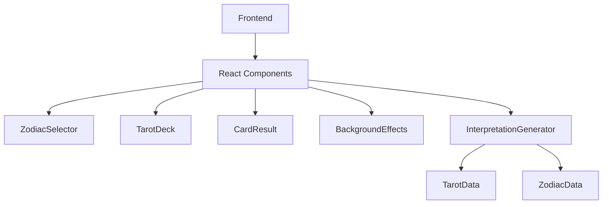

## 1. Architecture Design


## 2. Technology Description
- Frontend: React@18 + TypeScript + TailwindCSS@3 + Vite
- State Management: Zustand
- Icons: Lucide React
- Animation: CSS Animations + Framer Motion

## 3. Route Definitions
| Route | Purpose |
|-------|---------|
| / | 主页面，包含星座选择、牌堆展示、抽牌和解牌 |

## 4. API Definitions
无后端API需求，所有数据通过前端静态数据处理

## 5. Data Model

### 5.1 塔罗牌数据结构
```typescript
interface TarotCard {
  id: number;
  name: string;
  nameEn: string;
  type: 'major' | 'wands' | 'cups' | 'swords' | 'pentacles';
  element: 'fire' | 'water' | 'air' | 'earth' | 'arcana';
  color: string;
  number?: number;
  keywords: string[];
  interpretation: string;
}
```

### 5.2 星座数据结构
```typescript
interface ZodiacSign {
  id: string;
  name: string;
  symbol: string;
  dateRange: string;
  element: 'fire' | 'water' | 'air' | 'earth';
}
```

### 5.3 解牌生成逻辑
- 结合选中星座的元素属性与抽取卡牌的元素属性
- 根据元素相生相克关系生成解读
- 基于卡牌关键词和星座特性组合成运势内容

## 6. Component Structure
```
src/
├── components/
│   ├── ZodiacSelector.tsx    # 星座选择组件
│   ├── ZodiacCard.tsx        # 单个星座卡片
│   ├── TarotDeck.tsx         # 牌堆组件
│   ├── TarotCard.tsx         # 单张卡牌组件
│   ├── CardTable.tsx         # 牌桌组件
│   ├── CardResult.tsx        # 解牌结果组件
│   ├── StarryBackground.tsx  # 星空背景组件
│   └── FloatingGlow.tsx      # 浮动光晕组件
├── data/
│   ├── tarotCards.ts         # 塔罗牌数据
│   └── zodiacSigns.ts        # 星座数据
├── hooks/
│   └── useTarot.ts           # 抽牌逻辑hook
├── stores/
│   └── tarotStore.ts         # 状态管理
├── utils/
│   └── interpreter.ts        # 解牌生成工具
└── App.tsx
```

## 7. 技术亮点
- CSS渐变背景实现梦幻薰衣草紫色效果
- CSS动画实现星星粒子和浮动光晕
- 抽牌动画使用Framer Motion实现流畅过渡
- 响应式设计适配不同屏幕尺寸
